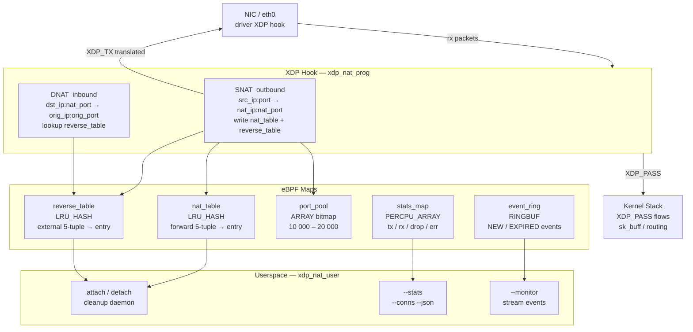

# eBPF XDP NAT

[](https://github.com/SepehrImanian/nat-ebpf-xdp/actions/workflows/ci.yml)
[](LICENSE)
[](https://www.kernel.org/)
[](https://ebpf.io/)

High-performance Network Address Translation (SNAT/DNAT) implemented as an
eBPF XDP program.  Packets are translated at the XDP hook — before the kernel
network stack sees them — giving near line-rate throughput with minimal CPU
overhead.

---

## Architecture



---

## Features

| Feature | Details |
|---|---|
| **Zero-copy processing** | XDP hook fires before `sk_buff` allocation |
| **SNAT + DNAT** | Correct bidirectional translation via separate forward and reverse maps |
| **Auto-eviction** | LRU hash maps automatically evict least-recently-used entries |
| **TCP / UDP / ICMP** | Full support; ICMP echo uses identifier field as the NAT "port" |
| **TCP state machine** | Tracks NEW → ESTAB → FIN/RST; FIN/RST connections expire in 10 s |
| **Incremental checksums** | L3 and L4 checksums updated incrementally (RFC 1624) |
| **Per-CPU stats** | Lock-free counters aggregated in userspace |
| **Ring-buffer events** | Optional zero-copy event stream for new/expired connections |
| **Connection dump** | `--conns` lists all active NAT sessions |
| **Monitor mode** | `--monitor` streams events to stdout in real time |
| **JSON output** | All output modes support `--json` |
| **Timeout cleanup** | Userspace daemon removes stale entries per-protocol timeout |
| **Configurable** | Port pool, timeouts, event logging all tunable at runtime |

---

## Quick Install

### One-liner (Ubuntu / Debian / Fedora)

```bash
curl -fsSL https://raw.githubusercontent.com/SepehrImanian/nat-ebpf-xdp/main/install.sh | sudo bash
```

The script installs all dependencies, builds from source, and places
`xdp_nat_user` in `/usr/local/bin` and `xdp_nat_kern.o` in `/usr/local/lib`.

### Manual build

```bash
# Ubuntu / Debian
sudo apt install clang llvm libbpf-dev linux-headers-$(uname -r) \
                 libelf-dev zlib1g-dev git

# Fedora / RHEL 9+
sudo dnf install clang llvm libbpf-devel kernel-devel elfutils-libelf-devel git

git clone https://github.com/SepehrImanian/nat-ebpf-xdp.git
cd nat-ebpf-xdp
make
sudo make install
```

### Docker

```bash
# Build the image
docker build -t nat-ebpf-xdp .

# Run (requires privileged + host network — eBPF loads into the host kernel)
docker run --rm --privileged --network host \
  nat-ebpf-xdp \
  --interface eth0 \
  --network 192.168.1.0/24 \
  --external-ip 203.0.113.1
```

### Docker Compose

Copy `.env.example` to `.env` and set your interface / IPs, then:

```bash
# Start NAT daemon
IFACE=eth0 INT_NETWORK=192.168.1.0/24 EXT_IP=203.0.113.1 \
  docker compose up -d nat

# Stream connection events
docker compose --profile monitor up monitor

# Print stats (JSON)
docker compose --profile stats run stats
```

---

## Requirements

| Requirement | Version |
|---|---|
| Linux kernel | ≥ 5.8 (LRU hash + ring buffer) |
| clang / llc | ≥ 10.0 |
| libbpf | ≥ 0.2 |
| Privileges | `CAP_SYS_ADMIN` / root |
| Kernel headers | matching running kernel |

---

## Usage

### Basic SNAT

```bash
# Translate traffic from 192.168.1.0/24 to external IP 203.0.113.1 on eth0
sudo xdp_nat_user -i eth0 -n 192.168.1.0/24 -e 203.0.113.1
```

### Custom port range and timeouts

```bash
sudo xdp_nat_user \
    -i eth0 \
    -n 192.168.1.0/24 \
    -e 203.0.113.1 \
    -s 15000 -E 25000 \      # port pool 15000–25000
    -t 3600 \                 # TCP idle timeout 1 h
    -u 120                    # UDP idle timeout 2 min
```

### Daemon mode (background cleanup)

```bash
sudo xdp_nat_user -i eth0 -n 192.168.1.0/24 -e 203.0.113.1 -d &
```

### Monitor new connections (ring buffer)

```bash
# -L enables kernel-side event emission; -m consumes them
sudo xdp_nat_user -i eth0 -n 192.168.1.0/24 -e 203.0.113.1 -L -m
```

Sample output:
```
[NEW]  TCP  192.168.1.42:54321 -> 203.0.113.1:12345 -> 93.184.216.34:443
[NEW]  UDP  192.168.1.10:1234  -> 203.0.113.1:18042 -> 8.8.8.8:53
[NEW]  ICMP 192.168.1.5:1      -> 203.0.113.1:20001 -> 1.1.1.1:0
```

### Dump active sessions

```bash
sudo xdp_nat_user -i eth0 -c
```

```
Int.IP:Port           Proto NAT IP:Port          Remote IP:Port        State Age(s)
--------------------- ----- -------------------- --------------------- ----- ------
192.168.1.42:54321    TCP   203.0.113.1:12345    93.184.216.34:443     ESTAB    42
192.168.1.10:1234     UDP   203.0.113.1:18042    8.8.8.8:53            NEW       1

2 active connection(s)
```

### Statistics

```bash
# Human-readable
sudo xdp_nat_user -i eth0 -S

# JSON (for monitoring pipelines)
sudo xdp_nat_user -i eth0 -S -j
```

### All CLI options

| Option | Default | Description |
|---|---|---|
| `-i, --interface IFACE` | required | Interface to attach XDP to |
| `-n, --network CIDR` | required* | Internal network (e.g. `192.168.1.0/24`) |
| `-e, --external-ip IP` | required* | External SNAT IP |
| `-s, --port-start PORT` | `10000` | First port in NAT pool |
| `-E, --port-end PORT` | `20000` | Last port in NAT pool |
| `-t, --tcp-timeout SECS` | `7440` | TCP idle timeout (2 h) |
| `-u, --udp-timeout SECS` | `300` | UDP idle timeout (5 min) |
| `-I, --icmp-timeout SECS` | `30` | ICMP idle timeout |
| `-S, --stats` | — | Print stats and exit |
| `-c, --conns` | — | Dump connection table and exit |
| `-m, --monitor` | — | Stream ring-buffer events |
| `-d, --daemon` | — | Run cleanup loop as daemon |
| `-L, --log-events` | off | Enable ring-buffer event emission |
| `-j, --json` | off | JSON output |
| `-h, --help` | — | Show help |

\* not required for `--stats` / `--conns`

---

## Testing

```bash
# Integration tests using Linux network namespaces (requires root)
make test

# Verify the BPF program passes the kernel verifier
sudo make test-load
```

The integration test script (`test_nat.sh`) creates three network namespaces
(internal, router, external), attaches XDP in generic mode, and validates
ICMP, TCP, and UDP translation end-to-end.

---

## Internals

### Map design

Two separate hash maps are used for O(1) lookup in both directions:

```
nat_table (forward):
  key  = {internal_ip, remote_ip, internal_port, remote_port, proto}
  val  = {orig_src_ip, orig_src_port, nat_ip, nat_port, last_seen, state}

nat_reverse_table:
  key  = {remote_ip, nat_ip, remote_port, nat_port, proto}
         (ICMP: remote_ip=0, remote_port=0 — keyed only by nat_id)
  val  = same nat_entry as forward table
```

Both maps are `BPF_MAP_TYPE_LRU_HASH`: when they fill, the kernel evicts the
least-recently-used entry automatically, preventing table exhaustion without
explicit timeout enforcement in the hot path.

### Port allocation

Port allocation uses a randomised starting index
(`bpf_get_prandom_u32() % range`) and probes up to 32 consecutive slots in
the `port_pool` bitmap.  This spreads allocation across all CPUs without
locks while keeping the probe window small enough for the BPF verifier.

### Checksum updates

IP, TCP, and UDP checksums are updated **incrementally** (RFC 1624) using
`bpf_csum_diff`, so only the changed fields are recomputed — not the full
packet.  ICMP checksums are also updated incrementally when the echo
identifier is rewritten.

### TCP state machine

```
NEW ──(SYN-ACK)──► ESTAB ──(FIN)──► FIN
 │                   │
 └──────(RST)────────┴──► RST
```

FIN and RST connections are evicted after 10 seconds regardless of the
configured TCP timeout, freeing ports quickly after session teardown.

### Connection expiry

The kernel LRU maps handle capacity-based eviction.  Time-based expiry runs
in userspace: the control tool walks `nat_table` every 30 seconds (daemon
mode) or on demand (`cleanup_expired()`), removes entries older than their
protocol timeout, and frees the corresponding port pool slots and reverse
table entries.

---

## Performance notes

| Mode | Throughput |
|---|---|
| Generic (SKB) mode | ~2–4 Mpps (kernel processes `sk_buff`) |
| Native driver mode | ~10–20 Mpps (no `sk_buff` allocation) |
| With XDP_REDIRECT | line rate on supported NICs |

Native mode requires a NIC driver with XDP support (most modern NICs: i40e,
mlx5, ixgbe, nfp, …).  The tool tries native mode first and falls back to
generic automatically.

For maximum throughput, consider:
- Using `XDP_REDIRECT` + `bpf_redirect_map()` to bypass the kernel routing
  path entirely (requires knowing the egress interface MAC).
- Pinning the control process to a dedicated CPU core.
- Increasing `net.core.netdev_max_backlog` and NIC ring sizes.

---

## Kernel parameters

```bash
# Raise connection tracking limit if running both iptables NAT and XDP NAT
echo 2000000 > /proc/sys/net/netfilter/nf_conntrack_max

# Increase NIC RX ring size (example: ethtool)
ethtool -G eth0 rx 4096

# Enable RSS for multi-queue NICs
ethtool -L eth0 combined 8
```

---

## Troubleshooting

**`Failed to open xdp_nat_kern.o`**  
Run `make` first, and ensure `xdp_nat_kern.o` is in the working directory.

**`Failed to attach XDP program in native mode`**  
Your NIC driver may not support XDP.  The tool falls back to generic mode
automatically.  Check with `ethtool -i <iface>` and look for XDP in
`/sys/class/net/<iface>/xdp_features`.

**`No stats shown after attaching`**  
Traffic may not be reaching the XDP hook.  Verify with
`ip link show <iface>` — look for `xdp` in the output.

**`Port pool exhausted`**  
Either the port range is too narrow or connections are not being cleaned up.
Widen the port range (`-s`/`-E`) or reduce timeouts (`-t`/`-u`).

**Ring buffer events not appearing in `--monitor`**  
Make sure `-L` (`--log-events`) is also passed.  Without it the kernel
program skips ring-buffer writes.

**Packets not being translated after interface rename / netns move**  
Re-attach the program: the XDP hook is bound to the interface index.

---

## Files

| File | Description |
|---|---|
| `nat_common.h` | Shared struct definitions (kernel + userspace) |
| `xdp_nat_kern.c` | eBPF XDP program |
| `xdp_nat_user.c` | Userspace control tool |
| `Makefile` | Build, install, and test targets |
| `test_nat.sh` | Integration tests using network namespaces |
| `install.sh` | One-shot installer script |
| `Dockerfile` | Multi-stage Docker build |
| `docker-compose.yml` | Compose services (nat, monitor, stats) |
| `.github/workflows/ci.yml` | GitHub Actions CI pipeline |

---

## License

GPL-2.0 — required for eBPF programs that call GPL-only kernel helpers.
